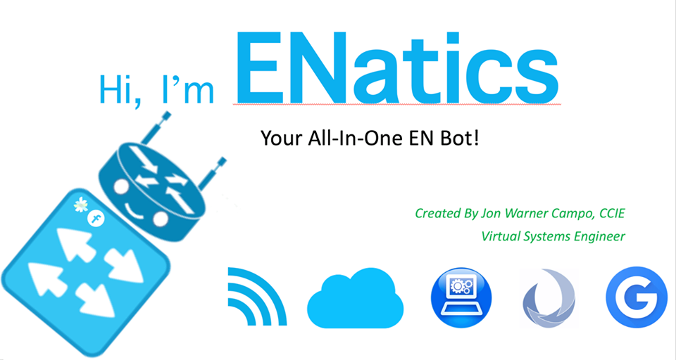
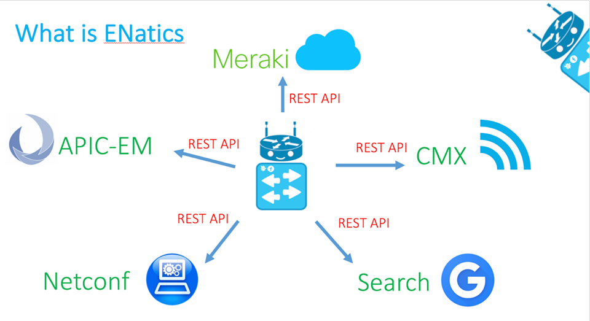
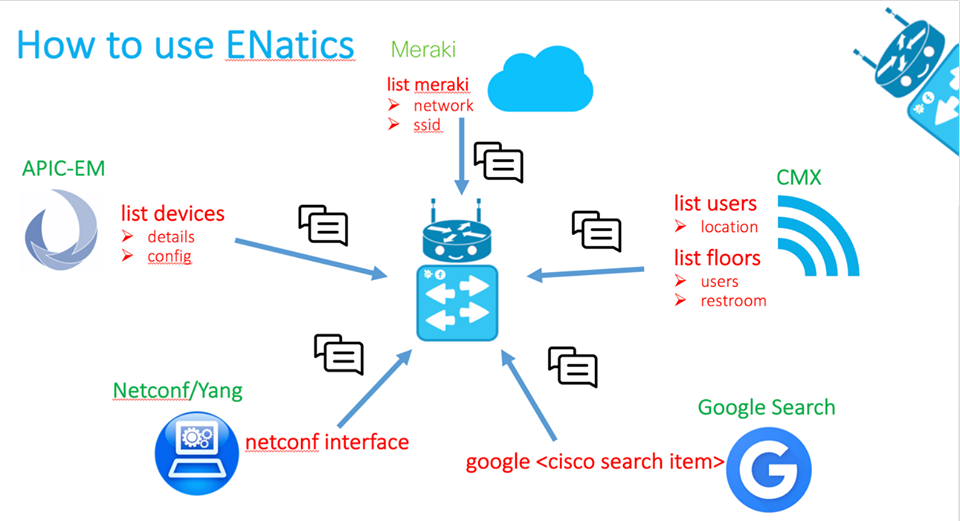

# ENatics-Spark
ENatics-Spark
Hi I'm ENatics! Your All-In-One EN Bot!

Table of Contents
=================

   * [ENatics](#enatics)
   * [Table of Contents](#table-of-contents)
      * [Features](#features)
      * [Quick Usage](#quick-usage)
      * [Installation Guide](#installation-guide)
    * [Demo](#demo)\cf2 \outl0\strokewidth0 \strokec2 \

Created by [{\field{\*\fldinst{HYPERLINK "https://github.com/joncampo"}}{\fldrslt https://github.com/joncampo}}]

## Features

## Quick Usage

## Installation Guide

1. Download or clone ENatics
2. Edit Settings.py and enter Platform IP Addresses and user/pass.
	a. For Spark bot, enter App ID from here - 
	b. For Facebook bot, enter App ID from here - 
3. Install the modules/libraries from requirements.txt
4. Install Heroku Tools
5. Create Heroku App
6. Deploy using Heroku procedure below:
	a. git add .
	b. git commit -m "Update"
	c. git push heroku master

## Demo

Note: By using this module, you agree to Terms of Service -  and Privacy Policy - 
